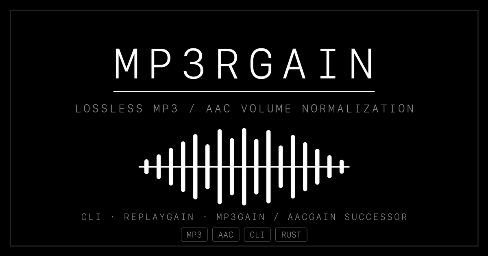
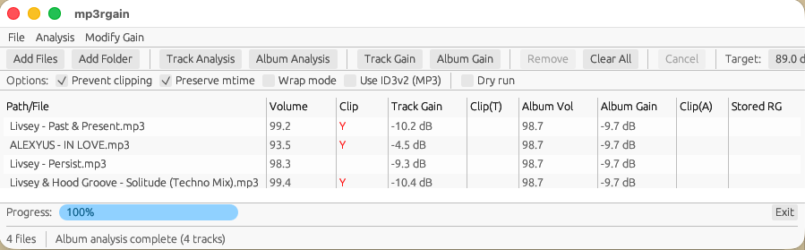

<p align="center">
  
</p>

# mp3rgain

[](https://opensource.org/licenses/MIT)
[](https://www.rust-lang.org)
[](https://crates.io/crates/mp3rgain)
[](https://m-igashi.github.io/mp3rgain/)
[](docs/compatibility-report.md)

**Lossless MP3/AAC volume adjustment - a modern mp3gain / aacgain replacement written in Rust**

🌐 **Website:** [mp3rgain.tyna.ninja](https://mp3rgain.tyna.ninja/) - install guide, full [CLI reference](https://mp3rgain.tyna.ninja/docs/cli), [FAQ](https://mp3rgain.tyna.ninja/faq), and [tool comparison](https://mp3rgain.tyna.ninja/vs-mp3gain)

mp3rgain adjusts MP3 and AAC volume without re-encoding by modifying the `global_gain` field in each frame. This preserves audio quality while achieving permanent volume changes.

- **Lossless & reversible**: no re-encoding; every change can be undone with `-u` (MP3 and AAC/M4A)
- **ReplayGain**: track and album analysis, with standard `REPLAYGAIN_*` tags written alongside the bitstream change
- **mp3gain / aacgain compatible**: drop-in replacement with identical CLI flags, TSV output, and undo tags
- **Zero dependencies**: single static binary; macOS, Linux, Windows (x86_64 and ARM64)
- **GUI application**: `mp3rgui`, a native desktop app for drag-and-drop workflows

## Installation

### Windows: download the installer

No terminal needed - Start Menu entry, uninstaller, Intel + ARM in one, no admin rights: **[Download mp3rgui for Windows](https://github.com/M-Igashi/mp3rgain/releases/latest/download/mp3rgui-windows-setup.exe)** (permanent link: <https://mp3rgain.tyna.ninja/download/windows>)

### CLI (`mp3rgain`)

| Platform | Command |
|----------|---------|
| macOS | `brew install M-Igashi/tap/mp3rgain` |
| Windows | `winget install M-Igashi.mp3rgain` |
| Arch Linux (AUR) | `yay -S mp3rgain-bin` |
| Ubuntu 26.04 LTS (PPA) | `sudo add-apt-repository ppa:m-igashi/mp3rgain && sudo apt install mp3rgain` |
| Debian | `sudo apt install ./mp3rgain_*_amd64.deb` ([download](https://github.com/M-Igashi/mp3rgain/releases)) |
| Nix/NixOS | `nix profile install github:M-Igashi/mp3rgain` |
| Docker | `docker pull ghcr.io/m-igashi/mp3rgain:latest` |
| Cargo | `cargo install mp3rgain` |

### GUI (`mp3rgui`)

| Platform | Command |
|----------|---------|
| macOS | `brew install --cask M-Igashi/tap/mp3rgui` |
| Windows | `winget install M-Igashi.mp3rgui` (portable; use the [installer](https://github.com/M-Igashi/mp3rgain/releases/latest/download/mp3rgui-windows-setup.exe) for a Start Menu entry) |
| Arch Linux (AUR) | `yay -S mp3rgui` |
| Ubuntu 26.04 LTS (PPA) | `sudo add-apt-repository ppa:m-igashi/mp3rgui && sudo apt install mp3rgui` |
| Debian/Ubuntu | `sudo apt install ./mp3rgui_*_amd64.deb` ([download](https://github.com/M-Igashi/mp3rgain/releases)) |

Binaries for all platforms are on [GitHub Releases](https://github.com/M-Igashi/mp3rgain/releases). For checksum verification and troubleshooting (Windows Defender false positives, missing OpenGL, PPA on older Ubuntu), see the **[install guide](https://mp3rgain.tyna.ninja/install)**.

> **macOS manual download:** if you see a "mp3rgui cannot be opened" warning, run `xattr -cr /path/to/mp3rgui.app` (not needed with Homebrew).

## Quick Start

```bash
mp3rgain -r song.mp3          # Normalize a single track (ReplayGain)
mp3rgain -a *.mp3             # Normalize an album
mp3rgain -s R -a -R /music    # Apply from stored tags, rescan only where missing (v3.4+)
mp3rgain -g 2 song.mp3        # Manual gain (+3.0 dB; 1 step = 1.5 dB)
mp3rgain -u song.mp3          # Undo
mp3rgain song.mp3             # Show file info
```

Run `mp3rgain -h` for all options, or see the **[full CLI reference](https://mp3rgain.tyna.ninja/docs/cli)** (analysis modes, tag handling, exit codes, recipes). Analysis runs in parallel by default; `-j 1` forces the serial path ([design and benchmarks](docs/perf-parallel.md)).

## Migrating from mp3gain?

mp3rgain is a drop-in replacement: CLI flags, TSV output, and the APEv2 `mp3gain_undo` tag are all mp3gain-compatible, so existing scripts and parsers (e.g. [beets](https://beets.io/)) keep working unchanged. For most setups migration is a one-line substitution:

```bash
sed -i 's/\bmp3gain\b/mp3rgain/g' your_script.sh
```

See **[docs/migrating-from-mp3gain.md](docs/migrating-from-mp3gain.md)** for the flag equivalence table, where the tags land (ID3v2 vs APEv2, and the `-s a` / `-s i` overrides), and the small set of intentional behaviour differences. Bit-level verification lives in [docs/compatibility-report.md](docs/compatibility-report.md).

## GUI Application

<p align="center">
  
</p>

`mp3rgui` covers the CLI's core workflow - track/album analysis and gain, undo, tag inspection, clipping prevention - with drag-and-drop loading and per-file progress. It shares the same apply pipeline as the CLI. Install via the table above.

## Docker / CI

Multi-arch images (`linux/amd64`, `linux/arm64`) are published to GHCR as `ghcr.io/m-igashi/mp3rgain` with tags `latest`, `v3`, and exact versions. The image is `FROM scratch` (~2 MB); the entrypoint is the binary itself, so all flags work as on the host:

```bash
docker run --rm --user "$(id -u):$(id -g)" -v /path/to/music:/music ghcr.io/m-igashi/mp3rgain:latest -r -R /music
```

## Library Usage

```rust
use mp3rgain::{apply_gain, analyze};
use std::path::Path;

let frames = apply_gain(Path::new("song.mp3"), 2)?;  // +3.0 dB
let info = analyze(Path::new("song.mp3"))?;
```

API documentation: [docs.rs/mp3rgain](https://docs.rs/mp3rgain).

## Why mp3rgain?

The original [mp3gain](http://mp3gain.sourceforge.net/) has been unmaintained upstream since ~2015, and [aacgain](http://aacgain.altosdesign.com/) since ~2009. mp3rgain is a memory-safe Rust replacement covering both formats, and the only maintained CLI for lossless AAC/M4A bitstream gain. It defaults to mp3gain-identical ReplayGain 1.0 values, with BS.1770 loudness (`--rg2` / `--r128`) as an opt-in. How it compares to rsgain, loudgain, foobar2000, and ffmpeg - and when to use those instead - is covered in the **[tool comparison](https://mp3rgain.tyna.ninja/vs-mp3gain)** and [docs/COMPARISON.md](docs/COMPARISON.md).

## Documentation

- [CLI Reference](https://mp3rgain.tyna.ninja/docs/cli) - options, analysis modes, exit codes, output formats, recipes
- [Install Guide](https://mp3rgain.tyna.ninja/install) - all platforms, verification, troubleshooting
- [Migration Guide](docs/migrating-from-mp3gain.md) - flag equivalence, substitution patterns, tag layout, beets config
- [Technical Comparison](docs/COMPARISON.md) - comparison with mp3gain, aacgain, and other ReplayGain tools
- [Compatibility Report](docs/compatibility-report.md) - bit-level verification against original mp3gain
- [Parallel Performance](docs/perf-parallel.md) - `-j` / `--threads` design and benchmarks
- [Use Cases](docs/use-cases.md) - integration examples (beets, headroom, etc.)
- [Security](docs/security.md) - memory safety and CVE analysis
- [Roadmap](docs/roadmap.md) - development plans
- [FAQ](https://mp3rgain.tyna.ninja/faq) · [Download Stats](https://m-igashi.github.io/mp3rgain/)

## Contributing

Contributions welcome! See [CONTRIBUTING.md](CONTRIBUTING.md).

## License

MIT License - see [LICENSE](LICENSE).

## See Also

- [Original mp3gain](http://mp3gain.sourceforge.net/)
- [headroom](https://github.com/M-Igashi/headroom) - DJ audio loudness optimizer
