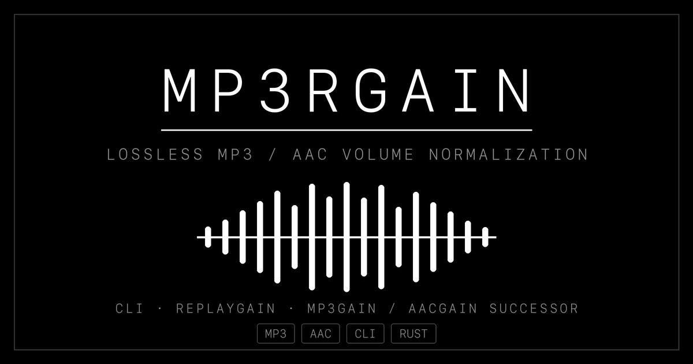
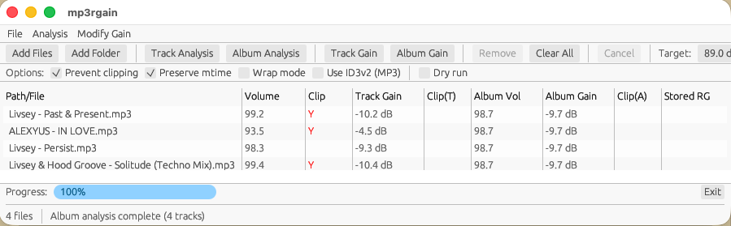

<p align="center">
  
</p>

# mp3rgain

[](https://opensource.org/licenses/MIT)
[](https://www.rust-lang.org)
[](https://crates.io/crates/mp3rgain)
[](https://m-igashi.github.io/mp3rgain/)
[](docs/compatibility-report.md)

**Lossless MP3/AAC volume adjustment - a modern mp3gain / aacgain replacement written in Rust**

mp3rgain changes the volume of MP3 and AAC files without re-encoding. It rewrites the `global_gain` value stored in each frame, the same field mp3gain and aacgain edit, so the audio is never decoded and compressed again and no quality is lost. It runs ReplayGain track and album analysis, writes standard `REPLAYGAIN_*` tags, and stores an undo tag so the change can be reverted.

🌐 **Website:** [mp3rgain.tyna.ninja](https://mp3rgain.tyna.ninja/): install guide, [CLI reference](https://mp3rgain.tyna.ninja/docs/cli), [FAQ](https://mp3rgain.tyna.ninja/faq) and [tool comparison](https://mp3rgain.tyna.ninja/vs-mp3gain)

- **Lossless**: only the per-frame `global_gain` field changes. Works on MP3, AAC in M4A/MP4 (including the audio track of a video MP4) and raw ADTS `.aac`.
- **Reversible**: `-u` restores the original gain from the undo tag. A frame whose gain would pass the 0..255 limit is clamped instead, cannot be restored exactly, and triggers a warning.
- **ReplayGain**: defaults to ReplayGain 1.0 with mp3gain-identical values. `--rg2` (ReplayGain 2.0, -18 LUFS) and `--r128` (EBU R128, -23 LUFS) use BS.1770 loudness instead. `--tags-only` writes the tags and leaves the audio alone.
- **mp3gain compatible**: mp3gain's flags, TSV output and `MP3GAIN_UNDO` tag, so scripts and tools built around mp3gain keep working.
- **Built for whole libraries**: recursive scans (`-R`), one album per folder or per release, parallel processing, JSON and TSV output.
- **One binary**: no runtime or codecs to install. macOS (universal), Linux and Windows, each on x86_64 and ARM64.
- **GUI**: `mp3rgui`, a desktop app with drag and drop.

**Preparing DJ tracks for rekordbox and CDJs?** [Bake'n Deck](https://baken.ravers.workers.dev) has mp3rgain built in and adds true peak ceiling gain for FLAC, AIFF and WAV, key + BPM playlist sorting, and a CDJ-safe MP3 export.

## Installation

### Windows installer (GUI, no terminal needed)

**[Download mp3rgui for Windows](https://github.com/M-Igashi/mp3rgain/releases/latest/download/mp3rgui-windows-setup.exe)** (permanent link: <https://mp3rgain.tyna.ninja/download/windows>). One installer covers x64 and ARM64, adds a Start Menu entry and an uninstaller, and needs no admin rights.

### Command line (`mp3rgain`)

| Platform | Command |
|----------|---------|
| macOS (Homebrew) | `brew install M-Igashi/tap/mp3rgain` |
| Windows (winget) | `winget install M-Igashi.mp3rgain` |
| Ubuntu 26.04 LTS (PPA) | `sudo add-apt-repository ppa:m-igashi/mp3rgain && sudo apt install mp3rgain` |
| Debian/Ubuntu (.deb) | `sudo apt install ./mp3rgain_*_amd64.deb` or `_arm64.deb` ([download](https://github.com/M-Igashi/mp3rgain/releases)) |
| Arch Linux (AUR, third-party) | `yay -S mp3rgain-bin` |
| Nix | `nix profile install github:M-Igashi/mp3rgain` |
| Docker | `docker pull ghcr.io/m-igashi/mp3rgain:latest` |
| Cargo (Rust 1.85+) | `cargo install mp3rgain` |

### GUI (`mp3rgui`)

| Platform | Command |
|----------|---------|
| macOS (Homebrew) | `brew install --cask M-Igashi/tap/mp3rgui` |
| Windows (winget) | `winget install M-Igashi.mp3rgui` (portable; use the installer above for a Start Menu entry) |
| Ubuntu 26.04 LTS (PPA) | `sudo add-apt-repository ppa:m-igashi/mp3rgui && sudo apt install mp3rgui` |
| Debian/Ubuntu (.deb) | `sudo apt install ./mp3rgui_*_amd64.deb` or `_arm64.deb` ([download](https://github.com/M-Igashi/mp3rgain/releases)) |
| Arch Linux (AUR) | `yay -S mp3rgui` |

Notes:

- Archives for every platform are on [GitHub Releases](https://github.com/M-Igashi/mp3rgain/releases). The **[install guide](https://mp3rgain.tyna.ninja/install)** covers checksum verification and troubleshooting (Windows Defender false positives, missing OpenGL, PPA on older Ubuntu).
- On macOS the GUI app and DMG are signed with a Developer ID and notarized. The CLI binary is not signed.
- Windows binaries and the installer are not code-signed.
- The PPA builds for Ubuntu 26.04 LTS only.
- `mp3rgain-bin` on the AUR is maintained by a third party. This project publishes only `mp3rgui` there.
- `mp3rgui` is not on crates.io. To build it from a clone, run `cargo build --release --manifest-path mp3rgui/Cargo.toml` (on Linux, install the GTK 3, xkbcommon and Wayland development packages first).

## Quick Start

```bash
mp3rgain song.mp3                       # Analyze only: print the recommended gain, change nothing
mp3rgain -r song.mp3                    # Apply track gain (ReplayGain)
mp3rgain -a *.mp3                       # Apply album gain: every file given is one album, as in mp3gain
mp3rgain -a --album-by=tag -R /music    # Whole library, one album per release (from tags)
mp3rgain -a --album-depth 2 -R /music   # Whole library, one album per Artist/Album folder
mp3rgain -s R -a *.mp3                  # Album gain from stored tags; rescan only if a file lacks them
mp3rgain -r --tags-only *.mp3           # Write ReplayGain tags, leave the audio alone
mp3rgain -g 2 song.mp3                  # Manual gain: +2 steps = +3.01 dB (1 step = 1.5051 dB)
mp3rgain -n -r *.mp3                    # Dry run: show what would change
mp3rgain -u song.mp3                    # Undo
```

Run `mp3rgain -h` for every option, or see the **[full CLI reference](https://mp3rgain.tyna.ninja/docs/cli)** (analysis modes, tag handling, exit codes, recipes). Files are processed in parallel by default; `-j 1` forces serial processing ([design and benchmarks](docs/perf-parallel.md)).

`-a` on its own pools every file you give it into one album, exactly as `mp3gain -a` does, so a per-album script written for mp3gain keeps working. To album-tag a whole library in one run, split it with `--album-by=tag` (tagged library), `--album-depth 2` (untagged `Artist/Album` tree) or `--album-by=dir` (alias `--per-directory`, when one folder is one album).

## Supported Formats

| Format | Gain and analysis | Where the tags go |
|--------|-------------------|-------------------|
| MP3 (MPEG-1, 2 and 2.5 Layer III) | Yes | `REPLAYGAIN_*` in ID3v2, undo data in APEv2 (`-s a`: all APEv2, `-s i`: all ID3v2) |
| AAC in M4A/MP4 | Yes | iTunes freeform atoms (`replaygain_*`, `mp3rgain_undo`) |
| Raw ADTS AAC (`.aac`) | Yes | ID3v2 tag at the start of the stream |
| ALAC, DRM-protected M4P | Skipped with a message | |
| FLAC, Opus, Ogg, WAV | Not supported | |

`-R` collects `.mp3`, `.m4a`, `.aac` and `.mp4` files. The format itself is detected from the file content, not the extension.

## Migrating from mp3gain?

mp3rgain is a drop-in replacement for most setups: the flags, the TSV output and the APEv2 `MP3GAIN_UNDO` tag match mp3gain, so existing scripts and parsers (e.g. [beets](https://beets.io/)) keep working. Migration is usually a one-line substitution:

```bash
sed -i 's/\bmp3gain\b/mp3rgain/g' your_script.sh
```

Two defaults differ. mp3rgain writes `REPLAYGAIN_*` to ID3v2, where players look, and keeps the undo data in APEv2, where mp3gain looks; `-s a` puts everything in APEv2 exactly as mp3gain does. And it re-analyzes every file, where mp3gain reuses stored values; `-s R` restores mp3gain's behaviour.

See **[docs/migrating-from-mp3gain.md](docs/migrating-from-mp3gain.md)** for the flag equivalence table, the tag layout and the other intentional differences. Bit-level verification against mp3gain lives in [docs/compatibility-report.md](docs/compatibility-report.md).

## GUI Application

<p align="center">
  
</p>

`mp3rgui` covers the CLI's core workflow: track and album analysis and gain (ReplayGain 1.0, 2.0 or EBU R128), a target volume, manual and per-channel gain, undo, stored tag inspection and deletion, and clipping prevention. Drag files or folders onto the window; a progress bar and a Cancel button track the batch. It runs the same apply code as the CLI. Install it from the table above.

Where it differs from the CLI:

- Album analysis groups files per folder by default (also "By tags" or "Single album"), while CLI `-a` pools every file into one album.
- Clipping prevention and timestamp preservation are on by default (`-k` and `-p` are off in the CLI).
- There is no tags-only mode and no true-peak option; use the CLI for those.

Platform notes: the macOS app needs macOS 11 or later. macOS and Linux draw with OpenGL 2.0+; Windows uses Direct3D 12 or Vulkan with a software fallback, and `MP3RGUI_RENDERER=glow` switches it to OpenGL. If the window cannot open, mp3rgui shows a dialog explaining why and pointing to the CLI. File names in Japanese, Chinese or Korean are rendered with a CJK font already installed on your system; set `MP3RGUI_FONT` to a font file path to pick a different one.

## Docker / CI

Multi-arch images (`linux/amd64`, `linux/arm64`) are published to GHCR as `ghcr.io/m-igashi/mp3rgain` with tags `latest`, `vX` (e.g. `v3`) and `vX.Y.Z`. The image is `FROM scratch` (~2 MB) with no shell; the entrypoint is the binary itself, so all flags work as on the host:

```bash
docker run --rm --user "$(id -u):$(id -g)" -v /path/to/music:/music ghcr.io/m-igashi/mp3rgain:latest -r -R /music
```

## Library Usage

```rust
use mp3rgain::{apply_gain, analyze};
use std::path::Path;

let frames = apply_gain(Path::new("song.mp3"), 2)?;  // +3.0 dB
let info = analyze(Path::new("song.mp3"))?;
```

`apply_gain` and `analyze` are low-level MP3 helpers: `apply_gain` rewrites the frames and writes no undo tag. The pipeline the CLI and GUI share (atomic write, undo and ReplayGain tags, MP3 and AAC) is `apply::apply_with_options`. API documentation: [docs.rs/mp3rgain](https://docs.rs/mp3rgain).

## Why mp3rgain?

The original [mp3gain](http://mp3gain.sourceforge.net/) has had no release since 1.6.2, and [aacgain](https://github.com/dgilman/aacgain) none since 2.0.0 (2019); their release builds still carry known CVEs ([docs/security.md](docs/security.md)). mp3rgain is a memory-safe Rust replacement that covers both formats in one tool. It defaults to mp3gain-identical ReplayGain 1.0 values, with BS.1770 loudness (`--rg2` / `--r128`) as an opt-in. How it compares to rsgain, loudgain, foobar2000 and ffmpeg, and when to use those instead, is covered in the **[tool comparison](https://mp3rgain.tyna.ninja/vs-mp3gain)** and [docs/COMPARISON.md](docs/COMPARISON.md).

## Documentation

- [CLI Reference](https://mp3rgain.tyna.ninja/docs/cli): options, analysis modes, exit codes, output formats, recipes
- [Install Guide](https://mp3rgain.tyna.ninja/install): all platforms, verification, troubleshooting
- [Migration Guide](docs/migrating-from-mp3gain.md): flag equivalence, substitution patterns, tag layout, beets config
- [Technical Comparison](docs/COMPARISON.md): mp3gain, aacgain and other ReplayGain tools
- [Compatibility Report](docs/compatibility-report.md): bit-level verification against the original mp3gain
- [Parallel Performance](docs/perf-parallel.md): `-j` / `--threads` design and benchmarks
- [Use Cases](docs/use-cases.md): integration examples (beets, Bake'n Deck, etc.)
- [Design Decisions](docs/design-decisions.md): things that look like defects but are deliberate, and where each was decided
- [Security](docs/security.md): memory safety and CVE analysis
- [Roadmap](docs/roadmap.md): development plans
- [Man page](docs/man/mp3rgain.1): installed by the .deb and PPA packages
- [FAQ](https://mp3rgain.tyna.ninja/faq) · [Download Stats](https://m-igashi.github.io/mp3rgain/)

## Contributing

Contributions welcome! See [CONTRIBUTING.md](CONTRIBUTING.md).

## License

MIT License. See [LICENSE](LICENSE).

## See Also

- [Original mp3gain](http://mp3gain.sourceforge.net/)
- [Bake'n Deck (baken)](https://baken.ravers.workers.dev): rekordbox → CDJ prep toolkit for DJs, with mp3rgain built in
